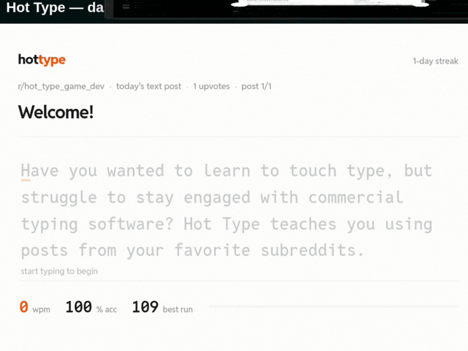

# Hot Type

Hot Type is a daily typing game that runs inside a Reddit post. Each day it pulls the top text posts from your community and asks you to retype them. The faster and cleaner you type, the higher you land on the day's leaderboard.

Most typing trainers drill you on random word lists. Hot Type uses real writing from a community you already follow, so the practice is worth reading. An on-screen keyboard shows the next key and marks the home row, so you build proper finger placement instead of hunting and pecking.

A full run is a circuit: you type the day's posts in order, and your combined speed across all of them is your score. Everyone races the same set, so the leaderboard actually means something. Come back tomorrow for a fresh circuit and keep your streak alive.

## How to play

Open the Hot Type post and start typing. That is the whole tutorial. Your fastest completed circuit each day goes on the community leaderboard, next to your personal best and daily streak.

Moderators add the game to a community from the subreddit menu ("Create a Hot Type post"), and can refresh the day's posts from the same menu.

## Notes

Hot Type works best in text-heavy communities, where posts have real bodies to type rather than just links or images.